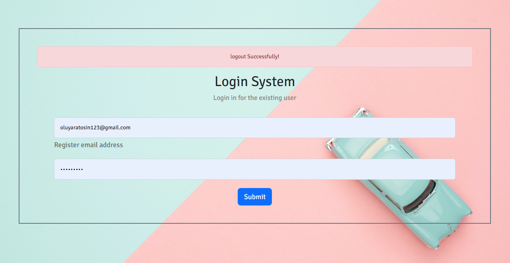

# Login System
The login system app is a student score board that allows every student to login specifically to see there test results

> NOTE: the dashboard is under contruction

## Technologies Used
* Language (Express, Node)
* Nodemon(server)

## Run app
* git clone 
* cd Login-System
* npm start (start node on server)

## Installation
* Node.js
* npm
* Express.js
* nodemon (to run server on local)

## 👤 Author 
Edward Yara :student: 
- GitHub: [@oluyaratosin123](https://github.com/oluyaratosin123)
- Twitter: [@TOluyara](https://twitter.com/TOluyara)
- LinkedIn: [LinkedIn](https://www.linkedin.com/in/edward-oluyara/)

## Contributing :handshake:
Contributions, issues, and feature requests are welcome!

## Show your support
Give a 	:star: if you like this project.

## Acknowledgments
* Hat tip to anyone whose code was used
* Inspiration
* etc
